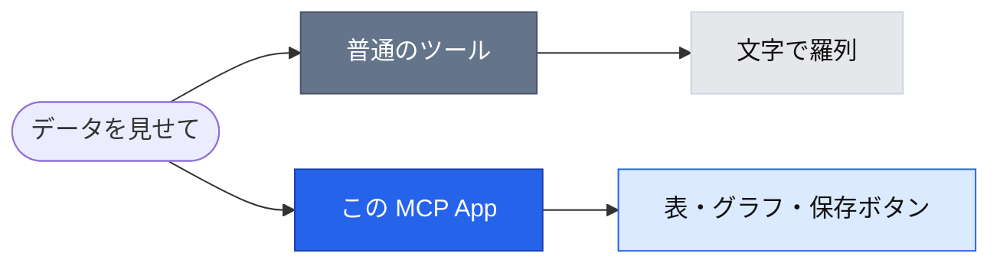

# MCP Data Dashboard

データを **表＋棒グラフのダッシュボード**としてチャットの中に表示する **MCP App** です。
検索・並べ替えができて、**JSON / CSV / HTML で保存**もできます。

 

---

## 概要

ふだん AI チャットのツールは「**文字で答える**」だけです。これは **チャットの中に“触れる画面”** を出します。



できること:

- 値の大きさで伸びる **棒グラフ** ＋ 集計（件数・合計・平均・最大）
- **ラベル検索** / 並べ替え / カテゴリの表示オン・オフ
- 保存形式（**JSON / CSV / HTML**）を選んで、ボタンひとつでローカルに保存

> 画面付きで使うには、MCP Apps の UI 描画に対応したホスト（Claude Desktop など）が必要です。

---

## 使い方

MCP ホストの設定ファイル（Claude Desktop の `claude_desktop_config.json` や `.mcp.json`）に登録し、ホストを再起動します。
チャットで「このデータをダッシュボードで見せて」と頼むと、会話の中に画面が出ます。

### npm に公開して使う

```bash
cd mcp-dashboard
npm login
npm publish --access public
```

公開後は、名前を書くだけで起動できます。

```json
{
  "mcpServers": {
    "data-dashboard": {
      "command": "npx",
      "args": ["-y", "@<アカウント名>/mcp-dashboard@latest", "--stdio"]
    }
  }
}
```

> npm にはまだ公開していません。

### 公開せず、手元のソースから動かす

`<クローン先>` は各自の置き場所に置き換えます（環境変数展開に対応するホストなら `${HOME}` や Windows なら `%USERPROFILE%` も可）。

```json
{
  "mcpServers": {
    "data-dashboard": {
      "command": "npx",
      "args": ["tsx", "<クローン先>/mcp-dashboard/main.ts", "--stdio"]
    }
  }
}
```

> このリポジトリはサブディレクトリ構成のため、`npx github:leomaro7/mcp` では動きません（npm/npx は Git のサブディレクトリを直接扱えないため）。将来変更になる可能性がありますが現状上の 2 通りで利用してください。

---

## 開発者向け（詳細）

<details><summary>ツール一覧</summary>

| ツール | UI | 役割 |
|--------|----|------|
| `show-dataset` | あり | データを受け取りダッシュボードを描画。引数なしでサンプル表示。`{ title?, unit?, rows: {label,value,category?}[] }` |
| `save-dataset` | なし | データを JSON で保存（保存プルダウンで JSON 選択時に UI から呼ばれる） |
| `save-csv` | なし | データを `label,value,category` の CSV で保存 |
| `save-html` | なし | 画面の見た目を自己完結 HTML として保存（ブラウザで開ける静的エクスポート） |

保存系はいずれも `path`（相対は `./saved` 配下に解決）を受け取り、`{ savedPath, bytes, savedAt }` を返します。
UI のボタン操作が `callServerTool` でサーバーのツールを呼び出す、MCP Apps の「往復」の実例です。

</details>

<details><summary>セットアップと開発コマンド</summary>

```bash
npm install            # 要件: Node.js v20+（bun は不要、すべて tsx で動作）

npm run dev            # UI を watch ビルドしつつ HTTP サーバーを起動
npm run build          # UI を単一 HTML にバンドル ＋ サーバーを JS にコンパイル
npm run serve          # HTTP サーバー（127.0.0.1:3001/mcp、ループバック限定）
npm run serve:stdio    # stdio で起動
npm run typecheck      # tsc --noEmit
```

サーバーは `dist/mcp-app.html` を読むため、`serve` の前に `build` が必要です。ポート変更は `PORT=3000 npm run serve`。

</details>

<details><summary>ローカルで画面を確認する（basic-host）</summary>

MCP App は単体では画面が出ません。SDK 付属の `basic-host` で確認できます。

```bash
# ターミナル1: このサーバー
npm run start          # http://localhost:3001/mcp

# ターミナル2: basic-host（確認用ホスト）
git clone --branch "v$(npm view @modelcontextprotocol/ext-apps version)" --depth 1 \
  https://github.com/modelcontextprotocol/ext-apps.git /tmp/mcp-ext-apps
cd /tmp/mcp-ext-apps && npm install --ignore-scripts
cd examples/basic-host
NODE_ENV=development INPUT=index.html  npx vite build
NODE_ENV=development INPUT=sandbox.html npx vite build
SERVERS='["http://localhost:3001/mcp"]' npx tsx serve.ts
```

`http://localhost:8080` を開いて `show-dataset` を実行 → サンプルが表＋棒グラフで表示されます。
（husky で `npm install` がこける場合は `--ignore-scripts`、`bun` は不要で `npx tsx` で動きます）

</details>

<details><summary>HTTP で疎通確認 / トラブルシュート</summary>

HTTP モードは **`127.0.0.1` 限定バインド＋DNS リバインディング保護**です（保存系がローカルに書き込むため、LAN や任意の Web オリジンには公開しません）。

```bash
curl -s -X POST http://localhost:3001/mcp \
  -H "Content-Type: application/json" -H "Accept: application/json, text/event-stream" \
  -d '{"jsonrpc":"2.0","id":1,"method":"tools/call","params":{"name":"show-dataset","arguments":{}}}'
```

| 症状 | 対処 |
|------|------|
| `EADDRINUSE`（ポート使用中） | `kill $(lsof -nP -tiTCP:3001 -sTCP:LISTEN)` |
| UI が出ずテキストだけ | ホストが MCP App 非対応。`basic-host` か Claude Desktop で確認 |
| サーバーは起動するが UI が出ない | `dist/mcp-app.html` 未ビルド → `npm run build` |

</details>

---

## ライセンス

MIT
